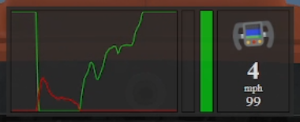

# open-overlay

A simple, open-source overlay for iRacing. Currently has a telemetry overlay with a brake and throttle trace, steering wheel angle, gear selection, and speed.

This project is dependent on my iRacing SDKWrapper Service. The service interfaces with the iRacing SDK to get the data from the simulation while doing some minimal processing. This project interfaces with the service via a web socket connection 

Built with [Electron.js](https://www.electronjs.org/) and [Vue.js](https://vuejs.org/). Project is scaffolded using [electron-vite](https://electron-vite.org/)



## Why does this exist?

I love sim racing and sometimes my friends watch me stream my races in Discord. I thought it would be neat to have a detailed telemetry overlay for them to see while I race, but the popular solutions on the market charge a monthly fee that is close to the subscription cost of iRacing. Other open-source solutiosn exist, such as [iRon](https://github.com/lespalt/iRon), but they haven't been updated in some time, and I thought it would be a fun learning opportunity to build this kind of thing from scratch myself.

I will update this repo sporadically as I learn more about how to maintain an open-source project and add new features and overlays. There will not be a regular release cadence as this is primarily for my own personal use and learning.

## Performance

I make no promises as to the stability or efficiency of the program. Other solutions are built with much more efficient tech stacks; iRon for example is built entirely in C and C++. Adding the service layer and communicating with it via web sockets is also not the most efficient way to access that data (see the github page for my SDKWrapper Service for the thought process behind that abstraction). Wrapping the SDK layer up into the same process would be more efficient, and I'm guessing that's what apps like [SimHub](https://www.simhubdash.com/) and [RaceLabs](https://racelab.app/) do. Unfortunately, the [C# wrapper](https://github.com/NickThissen/iRacingSdkWrapper) for the iRacing SDK service (which is cruelly written in C) that I use would mean that to do that easily, I would probably have to learn how to write a WPF .NET project. I started learning WPF. I didn't like it.

In short, plenty of performance sacrifices were made for me to be able to use as much of the knowledge I already have to reduce the amount of time I have to spend learning tech I don't think is cool or fun. Everyone online hates javascript, but it's way more fun to build reactive UI's with js than C#.   

All of this will undoubtedly incur a larger performance cost, but if I'm two things, I'm lazy and I'm a web developer. Simply put, it was easier and faster for me to learn Electron and build the UI in javascript than it would have been for me to learn C++.

All that said, I've been running this overlay during my league races while streaming in Discord and I have no issues whatsoever. It runs just fine on my machine, as it goes.

I am of course open to feedback or suggestions, and can be reached at <simple.overlay.dev@gmail.com>

## Project Setup
Assuming you are familiar with node projects, follow the below guide after cloning this repo.

### Install

```bash
$ npm install
```

### Development

```bash
$ npm run dev
```

### Build
While you can build an executable using the commands below, it is recommended to follow the [packaging guide](https://www.electronjs.org/docs/latest/tutorial/tutorial-packaging) and [publishing guide](https://www.electronjs.org/docs/latest/tutorial/tutorial-publishing-updating) on the Electron website. For end users, I will be updating this project using [Electron Forge](https://www.electronforge.io/), the recommended method of updating Electron apps.

```bash
# For windows
$ npm run build:win

# For macOS
$ npm run build:mac

# For Linux
$ npm run build:linux
```

## Attributions
F1 Steering wheel icon: <a href="https://www.flaticon.com/free-icons/f1" title="f1 icons">F1 icons created by Freepik - Flaticon</a>
